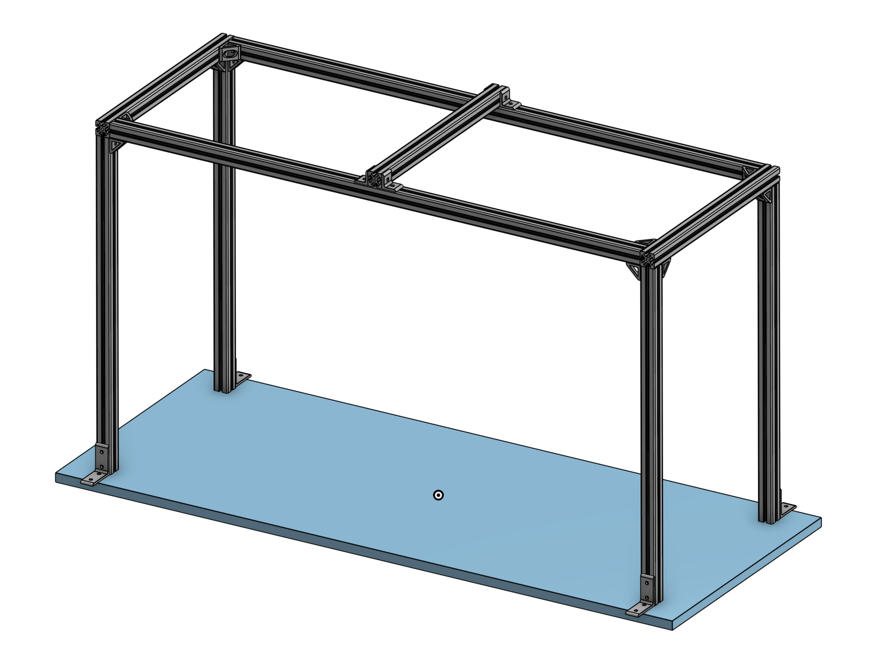

<h1>Hardware Studio Setup</h1>

## Studio CAD Model

We use the similar hardware setup as described in the DexYCB paper. Please check the Studio CAD Model [here](https://cad.onshape.com/documents/ac141300e03f08f590fbeecb/w/ad063a3527ccd1a24d289e93/e/13380efe91e477d6c0872bdb).

## List of Items

#### Studio Frame Items

| Item Name                                           | Quantity | Link                                                         |
| --------------------------------------------------- | -------- | ------------------------------------------------------------ |
| Bar clamp                                           | 4        | [McMASTER-CARR](https://www.mcmaster.com/5090A13/)           |
| T-Slotted Framing, 40 mm High Rail, 48" Long        | 4        | [McMASTER-CARR](https://www.mcmaster.com/5537T937/)          |
| T-Slotted Framing, 40 mm High Rail, 3-1/8" Long     | 4        | [McMASTER-CARR](https://www.mcmaster.com/5537T347/)          |
| T-Slotted Framing, 40 mm High x 40 mm Wide, 5' Long | 2        | [McMASTER-CARR](https://www.mcmaster.com/5537T102-5537T712/) |
| T-Slotted Framing, 40 mm High x 40 mm Wide, 2' Long | 3        | [McMASTER-CARR](https://www.mcmaster.com/5537T102-5537T105/) |
| T-Slotted Framing, 40 mm High x 40 mm Wide, 3' Long | 4        | [McMASTER-CARR](https://www.mcmaster.com/5537T102-5537T711/) |
| T-Slotted Framing, 1-5/8" Long for 40 mm High       | 6        | [McMASTER-CARR](https://www.mcmaster.com/5537T586/)          |

#### Cameras, Cables and Mounts

| Item Name                                         | Quantity | Link                                                                                                                                                                         |
| ------------------------------------------------- | -------- | ---------------------------------------------------------------------------------------------------------------------------------------------------------------------------- |
| Intel RealSense D455                              | 8        | [RealSense D455](https://www.realsenseai.com/products/real-sense-depth-camera-d455f/)                                                                                        |
| Azure Kinect DK                                   | 1        | [Kinect DK](https://azure.microsoft.com/en-us/services/kinect-dk/)                                                                                                           |
| USB 3.0 to USB C 90 Degree Angled Data Cable (5m) | 9        | [Amazon](https://a.co/d/00F2hv8H/)                                                                                                                                           |
| Camera Arm Mount                                  | 9        | [Manfrotto 035 Super Clamp](https://a.co/d/032UKg3z) [Manfrotto 143BKT Camera Bracket](https://a.co/d/07FakzuY) [Manfrotto 244N Friction Arm](https://a.co/d/0g6rV6nl) |
| USB 3.0 (5 Ports) PCI Express Card                | 1        | [Amazon](https://a.co/d/0hoQoDgP)                                                                                                                                            |
| Samsung SSD 860 EVO 2TB                           | 1        | [Amazon](https://a.co/d/0b2W28ad)                                                                                                                                            |
